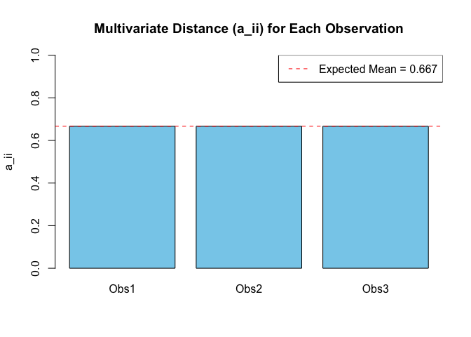

# p.21

## Covariance Derivation

The covariance between two random variables $X_1$ and $X_2$ is defined
as:

$$
\text{Cov}(X_1, X_2) = \mathbb{E}\left[(X_1 - \mathbb{E}(X_1))(X_2 - \mathbb{E}(X_2))\right]
$$

### Step 1: Expanding the expression

First, expand the product inside the expectation:

$$
(X_1 - \mathbb{E}(X_1))(X_2 - \mathbb{E}(X_2)) = X_1X_2 - X_1\mathbb{E}(X_2) - \mathbb{E}(X_1)X_2 + \mathbb{E}(X_1)\mathbb{E}(X_2)
$$

### Step 2: Taking the expectation

Now, take the expectation of both sides:

$$
\mathbb{E}\left[(X_1 - \mathbb{E}(X_1))(X_2 - \mathbb{E}(X_2))\right] = \mathbb{E}(X_1X_2) - \mathbb{E}(X_1)\mathbb{E}(X_2) - \mathbb{E}(X_1)\mathbb{E}(X_2) + \mathbb{E}(X_1)\mathbb{E}(X_2)
$$

### Step 3: Simplifying the result

Notice that the terms $\mathbb{E}(X_1)\mathbb{E}(X_2)$ cancel out:

$$
\mathbb{E}(X_1X_2) - \mathbb{E}(X_1)\mathbb{E}(X_2)
$$

Thus, we arrive at the final formula for the covariance:

$$
\text{Cov}(X_1, X_2) = \mathbb{E}(X_1X_2) - \mathbb{E}(X_1)\mathbb{E}(X_2)
$$

------------------------------------------------------------------------

# p.22

## Covariance Derivation in Confirmatory Factor Analysis

We start with the observed variables $x_1$ and $x_2$:

$$
x_1 = \lambda_1 \xi_1 + \delta_1
$$ $$
x_2 = \lambda_2 \xi_1 + \delta_2
$$

We want to find $\text{Cov}(x_1, x_2)$:

$$
\text{Cov}(x_1, x_2) = \text{Cov}(\lambda_1 \xi_1 + \delta_1, \lambda_2 \xi_1 + \delta_2)
$$

Using bilinearity of covariance:

$$
= \lambda_1 \lambda_2 \text{Cov}(\xi_1, \xi_1) + \lambda_1 \text{Cov}(\xi_1, \delta_2) + \lambda_2 \text{Cov}(\delta_1, \xi_1) + \text{Cov}(\delta_1, \delta_2)
$$

Assuming:  
- $\text{Cov}(\xi_1, \delta_2) = 0$  
- $\text{Cov}(\delta_1, \xi_1) = 0$  
- $\text{Cov}(\delta_1, \delta_2) = 0$  
- $\text{Var}(\xi_1) = \phi_{11}$  

Then:

$$
\text{Cov}(x_1, x_2) = \lambda_1 \lambda_2 \phi_{11}
$$

------------------------------------------------------------------------

# p.23

## 1. Derivation: Cov(x, c′) = 0

Let $\mathbf{x}$ be a random vector and $\mathbf{c}$ a constant vector.

$$
\text{Cov}(\mathbf{x}, \mathbf{c}^\top) = \mathbb{E} \left[ (\mathbf{x} - \mathbb{E}[\mathbf{x}])(\mathbf{c}^\top - \mathbb{E}[\mathbf{c}^\top]) \right]
$$

But since $\mathbf{c}^\top$ is constant,
$\mathbb{E}[\mathbf{c}^\top] = \mathbf{c}^\top$, so:

$$
\mathbf{c}^\top - \mathbb{E}[\mathbf{c}^\top] = \mathbf{0}
$$

Hence:

$$
\text{Cov}(\mathbf{x}, \mathbf{c}^\top) = \mathbb{E} \left[ (\mathbf{x} - \mathbb{E}[\mathbf{x}]) \cdot \mathbf{0} \right] = \mathbf{0}
$$

## 2. Derivation: Var(x) = Cov(x, x′) = Σ

By definition:

$$
\text{Var}(\mathbf{x}) = \text{Cov}(\mathbf{x}, \mathbf{x}^\top) = \mathbb{E} \left[ (\mathbf{x} - \mathbb{E}[\mathbf{x}])(\mathbf{x} - \mathbb{E}[\mathbf{x}])^\top \right]
$$

This is the population covariance matrix, denoted as:

$$
\boldsymbol{\Sigma}
$$

## 3. Numerical Example in R

``` r
# Set seed and generate data
set.seed(123)

# Simulate random vector x (5 observations, 3 variables)
x <- matrix(c(1, 2, 3, 4, 5,
              2, 3, 4, 5, 6,
              5, 4, 3, 2, 1), ncol = 3)

x
```

    ##      [,1] [,2] [,3]
    ## [1,]    1    2    5
    ## [2,]    2    3    4
    ## [3,]    3    4    3
    ## [4,]    4    5    2
    ## [5,]    5    6    1

``` r
x_centered <- scale(x, center = TRUE, scale = FALSE)
x_centered
```

    ##      [,1] [,2] [,3]
    ## [1,]   -2   -2    2
    ## [2,]   -1   -1    1
    ## [3,]    0    0    0
    ## [4,]    1    1   -1
    ## [5,]    2    2   -2
    ## attr(,"scaled:center")
    ## [1] 3 4 3

## 4. Confirm Var(x) = Cov(x, x′)

``` r
# Compute covariance matrix of x manually
# population covariance matrix
Sigma_manual_p <- t(x_centered) %*% x_centered / (nrow(x))
Sigma_manual_p
```

    ##      [,1] [,2] [,3]
    ## [1,]    2    2   -2
    ## [2,]    2    2   -2
    ## [3,]   -2   -2    2

``` r
# sample covariance matrix
Sigma_manual_s <- t(x_centered) %*% x_centered / (nrow(x) - 1)
Sigma_manual_s
```

    ##      [,1] [,2] [,3]
    ## [1,]  2.5  2.5 -2.5
    ## [2,]  2.5  2.5 -2.5
    ## [3,] -2.5 -2.5  2.5

``` r
# Compare with built-in cov()
# sample covariance matrix
Sigma_builtin <- cov(x)
Sigma_builtin
```

    ##      [,1] [,2] [,3]
    ## [1,]  2.5  2.5 -2.5
    ## [2,]  2.5  2.5 -2.5
    ## [3,] -2.5 -2.5  2.5

------------------------------------------------------------------------

# p.28

## Step 1: Create the data for Disposable Income and Consumers’ Expenditures

``` r
income <- c(433, 483, 479, 486, 494, 498, 511, 534, 478, 440, 372, 381, 419, 449, 511, 520, 477, 517, 548, 629)

consum <- c(394, 423, 437, 434, 447, 447, 466, 474, 439, 399, 350, 364, 392, 416, 463, 469, 444, 471, 494, 529)
```

## Step 2: Combine the data into a matrix

``` r
data <- cbind(consum, income)

data
```

    ##       consum income
    ##  [1,]    394    433
    ##  [2,]    423    483
    ##  [3,]    437    479
    ##  [4,]    434    486
    ##  [5,]    447    494
    ##  [6,]    447    498
    ##  [7,]    466    511
    ##  [8,]    474    534
    ##  [9,]    439    478
    ## [10,]    399    440
    ## [11,]    350    372
    ## [12,]    364    381
    ## [13,]    392    419
    ## [14,]    416    449
    ## [15,]    463    511
    ## [16,]    469    520
    ## [17,]    444    477
    ## [18,]    471    517
    ## [19,]    494    548
    ## [20,]    529    629

## Step 3: Center the data by subtracting the mean of each variable

``` r
Z <- scale(data, center = TRUE, scale = FALSE)  # Centers the data (but doesn't scale it)
Z
```

    ##       consum  income
    ##  [1,]  -43.6  -49.95
    ##  [2,]  -14.6    0.05
    ##  [3,]   -0.6   -3.95
    ##  [4,]   -3.6    3.05
    ##  [5,]    9.4   11.05
    ##  [6,]    9.4   15.05
    ##  [7,]   28.4   28.05
    ##  [8,]   36.4   51.05
    ##  [9,]    1.4   -4.95
    ## [10,]  -38.6  -42.95
    ## [11,]  -87.6 -110.95
    ## [12,]  -73.6 -101.95
    ## [13,]  -45.6  -63.95
    ## [14,]  -21.6  -33.95
    ## [15,]   25.4   28.05
    ## [16,]   31.4   37.05
    ## [17,]    6.4   -5.95
    ## [18,]   33.4   34.05
    ## [19,]   56.4   65.05
    ## [20,]   91.4  146.05
    ## attr(,"scaled:center")
    ## consum income 
    ## 437.60 482.95

## Step 4: Compute Z’ (transpose of Z)

``` r
Z_t <- t(Z)
Z_t
```

    ##          [,1]   [,2]  [,3]  [,4]  [,5]  [,6]  [,7]  [,8]  [,9]  [,10]   [,11]
    ## consum -43.60 -14.60 -0.60 -3.60  9.40  9.40 28.40 36.40  1.40 -38.60  -87.60
    ## income -49.95   0.05 -3.95  3.05 11.05 15.05 28.05 51.05 -4.95 -42.95 -110.95
    ##          [,12]  [,13]  [,14] [,15] [,16] [,17] [,18] [,19]  [,20]
    ## consum  -73.60 -45.60 -21.60 25.40 31.40  6.40 33.40 56.40  91.40
    ## income -101.95 -63.95 -33.95 28.05 37.05 -5.95 34.05 65.05 146.05
    ## attr(,"scaled:center")
    ## consum income 
    ## 437.60 482.95

## Step 5: Compute Z’Z (matrix multiplication of Z’ and Z)

``` r
Z_t_Z <- Z_t %*% Z
Z_t_Z
```

    ##         consum   income
    ## consum 35886.8 47584.60
    ## income 47584.6 64992.95

## Step 6: Apply the 1/(N-1) factor

``` r
N <- nrow(Z)  # Number of observations (rows)
cov_matrix_manual <- (1 / (N - 1)) * Z_t_Z

# Display the result
print(cov_matrix_manual)
```

    ##          consum   income
    ## consum 1888.779 2504.453
    ## income 2504.453 3420.682

------------------------------------------------------------------------

# p.28

## Introduction

In multivariate statistics, it is often important to detect observations
that deviate significantly from the center of the multivariate data
cloud. One useful tool is the matrix:

$$
\mathbf{A} = \mathbf{Z(Z'Z)^{-1}Z'}
$$

Where:

$\mathbf{Z}$ is the mean-centered data matrix of size
$N \times (p + q)$,

$\mathbf{Z}'\mathbf{Z}$ is the cross-product matrix,

$(\mathbf{Z}'\mathbf{Z})^{-1}$ is its inverse,

$\mathbf{A}$ is a square $N \times N$ matrix whose diagonal entries
$a_{ii}$ represent the multivariate “distance” of each observation from
the center.

The average value of $a_{ii}$ is:

$$
\frac{(p + q)}{N}
$$

Observations with much higher $a_{ii}$ values than the average are
potential **multivariate outliers**.

## Step-by-Step Example

We will use a simple example dataset with 3 observations and 2
variables.

``` r
# Define the data matrix (3 observations, 2 variables)
X <- matrix(c(2, 3, 4, 4, 6, 5), ncol = 2, byrow = FALSE)
colnames(X) <- c("X1", "X2")
rownames(X) <- paste0("Obs", 1:3)
X
```

    ##      X1 X2
    ## Obs1  2  4
    ## Obs2  3  6
    ## Obs3  4  5

## Step 1: Center the Data (Create Z)

We subtract the mean from each variable to obtain the matrix
$\mathbf{Z}$.

``` r
Z <- scale(X, center = TRUE, scale = FALSE)
Z
```

    ##      X1 X2
    ## Obs1 -1 -1
    ## Obs2  0  1
    ## Obs3  1  0
    ## attr(,"scaled:center")
    ## X1 X2 
    ##  3  5

## Step 2: Compute $\mathbf{Z}'\mathbf{Z}$

``` r
ZtZ <- t(Z) %*% Z
ZtZ
```

    ##    X1 X2
    ## X1  2  1
    ## X2  1  2

## Step 3: Compute $(\mathbf{Z}'\mathbf{Z})^{-1}$

``` r
ZtZ_inv <- solve(ZtZ)
ZtZ_inv
```

    ##            X1         X2
    ## X1  0.6666667 -0.3333333
    ## X2 -0.3333333  0.6666667

## Step 4: Compute $\mathbf{A} = \mathbf{Z}(\mathbf{Z}'\mathbf{Z})^{-1}\mathbf{Z}'$

``` r
A <- Z %*% ZtZ_inv %*% t(Z)
round(A, 3)
```

    ##        Obs1   Obs2   Obs3
    ## Obs1  0.667 -0.333 -0.333
    ## Obs2 -0.333  0.667 -0.333
    ## Obs3 -0.333 -0.333  0.667

## Step 5: Extract Diagonal Elements $a_{ii}$

These diagonal values represent the multivariate distance for each
observation.

``` r
a_ii <- diag(A)
names(a_ii) <- rownames(X)
a_ii
```

    ##      Obs1      Obs2      Obs3 
    ## 0.6666667 0.6666667 0.6666667

## Step 6: Compare to Expected Average

``` r
p_plus_q <- ncol(Z)  # total number of observed variables (p + q)
N <- nrow(Z)  # number of observations
expected_mean <- p_plus_q / N
expected_mean
```

    ## [1] 0.6666667

Any $a_{ii}$ significantly greater than 0.6666667 may indicate a
multivariate outlier.

## Step 7: Visualization

``` r
barplot(a_ii, names.arg = names(a_ii), 
        main = "Multivariate Distance (a_ii) for Each Observation", 
        ylab = "a_ii", col = "skyblue", ylim = c(0, 1))
abline(h = expected_mean, col = "red", lty = 2)
legend("topright", legend = paste("Expected Mean =", round(expected_mean, 3)), 
       col = "red", lty = 2)
```

<!-- -->

## Conclusion

- Matrix $\mathbf{A} = \mathbf{Z(Z'Z)^{-1}Z'}$ provides a way to measure
  the multivariate distance of each observation.
- Diagonal values $a_{ii}$ indicate how far each case is from the
  multivariate mean.
- The average of the $a_{ii}$’s is $\frac{(p + q)}{N}$, which provides a
  benchmark.
- Observations with high $a_{ii}$ values are flagged as potential
  **outliers** in multivariate space.

This method is especially helpful in the context of SEM, factor
analysis, or other multivariate procedures where unusual cases may
affect model fit or estimates.
